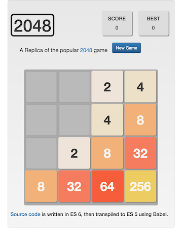

# 2048 Replica
**You can view the live version [here](http://charliegdev.github.io/2048_replica/).**

This is my own replica of the popular game [2048](https://gabrielecirulli.github.io/2048/).
I wrote it in HTML, CSS and Javascript (ECMAScript 6), with jQuery and Bootstrap.

The project is not entirely finished yet, but you can view the source code here, and click the link
above to see the work in progress.

ES 6 once caused compatibility problems on Safari and IE; as a result, I transpiled the source code from ES 6 to ES 5.1 using Babel. 
Now the game should run fine on all modern desktop browsers.

## Progress
- UI with Bootstrap 
- Tile spawning
- Tile movement
- Collision detection 
- Tile merge algorithm
- Display Correct Numbers in Tiles
- Github page
- Transpile

## Goals
- [ ] Score
- [ ] Mobile Page

## Issues
- [ ] Zooming in/out the page will leave gaps between tile and board grid
- [ ] The current way of tile movement utilize marginTop/marginLeft, that might be improved

## ECMAScript 6 Features Used
- Block scope variable declarations
- Constants
- Arrow functions
- Template literals

